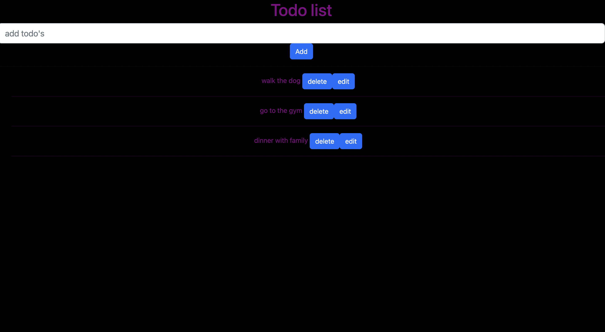

# Social-network-api

## Description
This a simple Todo-list fron-end app that uses React and lets the user add Todo's.

    
## Screenshot

## Table of Contents
* [Installation](#installation)
* [Usage](#usage)
* [License](#license)
* [Contributors](#contributors)
* [Tests](#tests)
* [Questions](#questions)
    
## Installation

## Usuage

## License
MIT

## Contributions
Birhanu Mengistu

## Tests
N/A

## Questions

How to reach me:

Github : https://github.com/linotmike

Email : linotmike.mk@gmail.com

## Links

Github repo: https://github.com/linotmike/bucket-list

    
